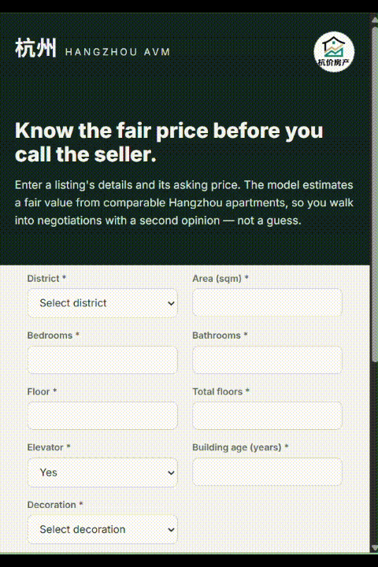

# 🏙️ Hangzhou AVM — Automated Valuation Model for Real Estate

**An end-to-end machine learning application that estimates fair market value for apartments in Hangzhou, China — from raw tabular data to a deployed, user-facing product.**

<p align="left">
  
  
  
  
  
  
</p>

---

## 🎥 DEMO

<p align="center">
  
</p>

---

## 📖 Project Overview

**Hangzhou AVM** (Automated Valuation Model) predicts the fair market price of an apartment in Hangzhou based on its physical characteristics, location, and building attributes. A user pastes in a listing's details along with its asking price, and the application returns:

- 📊 A model-estimated fair value
- 💰 The absolute and percentage difference from the listed price
- 🟢🔴🟡 A plain-language verdict — **fairly priced**, **possibly overpriced**, or **possibly underpriced**

This is a classic tabular regression problem — but the goal of this repository isn't just to train a model that scores well on a hold-out set. It's to demonstrate what happens *after* the notebook: turning a serialized model into a working application with a real API, a validated request/response contract, and an interface a non-technical person could actually use.

---

## 🎯 Why This Project

House price prediction is one of the first projects almost every aspiring data scientist builds. What differentiates this repository is the emphasis on **the second half of the ML lifecycle** — the part that's often skipped in portfolio projects:

- ✅ End-to-end ML workflow, from raw data to deployed inference
- ✅ Realistic handling of **tabular data**, still the most common data type in industry ML
- ✅ Deliberate **data preprocessing** and **feature engineering** decisions
- ✅ A trained, **serialized model** (not just a notebook cell that runs once)
- ✅ A typed, validated **backend API** built with production patterns in mind
- ✅ A clean, usable **frontend** — not a Streamlit demo thrown together in 20 minutes
- ✅ Product-level thinking about **what a user actually needs to input**

This project reflects how I think about shipping machine learning, not just evaluating it.

---

## ✨ Features

- 🔮 **Price prediction** via a trained XGBoost regression pipeline
- 🧭 **District-based enrichment** — automatically derives West Lake proximity and green-space ratio from the selected district, so the user doesn't have to know or guess those values
- 🎚️ **Required vs. optional inputs** — 9 core fields drive the estimate; everything else is optional and backed by sensible defaults
- ⚡ **FastAPI backend** with Pydantic-validated request/response schemas
- 🖥️ **Single-page frontend** (HTML/CSS/JS) with a clean, dropdown-driven form — no manual typos on categorical fields
- 🚦 **Verdict logic** — plain-language interpretation of the price gap, not just a raw number
- 📐 **Configurable API base** — frontend and backend are decoupled and can be deployed independently

---

## 🔄 Application Workflow

```
┌─────────────────┐      ┌──────────────────┐      ┌────────────────────┐      ┌─────────────────┐
│   User fills    │ ───▶  FastAPI receives  │ ───▶  Predictor enriches │ ───▶  XGBoost pipeline│
│  listing form   │      │  & validates JSON│      │  + fills defaults  │      │  returns price  │
└─────────────────┘      └──────────────────┘      └────────────────────┘      └────────┬────────┘
                                                                                        │
┌─────────────────┐      ┌──────────────────┐                                           │
│  Verdict shown: │ ◀──   Frontend compares│ ◀─────────────────────────────────────────┘
│  🟢 🔴 🟡      │     │  listed vs. fair │
└─────────────────┘      └──────────────────┘
```

1. User enters apartment details (district, area, layout, condition, etc.) and the listed asking price.
2. The frontend sends a validated JSON payload to the `/predict` endpoint.
3. The backend enriches the payload (e.g. district → distance to West Lake, green ratio), fills in defaults for any omitted optional fields, and runs it through the trained pipeline.
4. The predicted fair value (in 万 / 10k yuan) is returned along with model version and inference latency.
5. The frontend computes the delta against the listed price and renders a clear verdict.

---

## 🛠️ Tech Stack

| Layer | Technology |
|---|---|
| **Modeling** | XGBoost, scikit-learn (`Pipeline`, `ColumnTransformer`, `OneHotEncoder`) |
| **Data handling** | pandas |
| **Backend API** | FastAPI, Pydantic, Uvicorn |
| **Serialization** | pickle |
| **Frontend** | HTML5, CSS3 (custom, no framework), vanilla JavaScript (`fetch` API) |
| **Typography** | Inter (Google Fonts) |

No heavy frontend framework was used intentionally — the goal was a fast, dependency-light interface that any recruiter can open and understand at a glance.

---

## 🧪 Machine Learning Pipeline

1. **Exploratory Data Analysis** — understanding distributions of price, area, district frequency, and correlations between structural features and price.
2. **Preprocessing** — handling missing values, encoding categorical variables (district, decoration, developer, property type, subway line, school district tier) via `OneHotEncoder`, and scaling/passing through numeric features.
3. **Feature Engineering** — deriving location-quality signals (`west_lake_distance_m`, `green_ratio`) from district rather than requiring the user to know them; defaulting `subway_distance_m` when unknown.
4. **Model Training** — XGBoost regressor wrapped inside a scikit-learn `Pipeline` so preprocessing and inference travel together as one artifact.
5. **Evaluation** — hold-out validation to sanity-check generalization before serialization.
6. **Serialization** — the fitted pipeline is pickled (`XGmodel.pkl`) and loaded once at API startup, not per request.
7. **Inference Service** — a `HousePredictor` class wraps the model, handles enrichment, default-filling, and structured logging of every prediction (payload, predicted price, latency).

> ⚠️ **Version pinning matters.** Pickled scikit-learn objects are not guaranteed stable across versions — this project pins `scikit-learn==1.7.1` to match the environment the model was trained in.

---

## 🧑‍🎨 User Experience Design

A key engineering decision in this project: **not every feature the model was trained on is asked of the user.**

The original feature set includes 18 inputs — but forcing a user to manually enter management fee per square meter, parking ratio, or exact subway distance before getting a single estimate is a poor product experience. Instead:

- **9 core fields** (district, area, bedrooms, bathrooms, floor, total floors, elevator, building age, decoration) are required — these are the fields any buyer looking at a listing would naturally know.
- **The remaining fields are optional**, tucked behind an "Add more details" toggle, and backed by defaults on the backend so the pipeline never breaks on missing data.
- **Categorical inputs are dropdowns, not free text** — district, decoration, property type, developer, subway line, and school tier are all selected from fixed lists, eliminating typos and unseen-category issues at inference time.

This reflects a broader principle: **model performance and user convenience are both product requirements**, and a real application has to balance them rather than optimizing for one at the expense of the other. Future versions could auto-infer some optional fields (e.g. subway distance from an address lookup) rather than asking the user directly.

---

## 📁 Folder Structure

```
hangzhouagency/
├── backend/
│   ├── main.py            # FastAPI app, routes, CORS, lifespan model loading
│   ├── predict.py         # HousePredictor: enrichment, defaults, inference
│   ├── schemas.py         # Pydantic request/response models
│   └── requirements.txt   # Pinned backend dependencies
├── ml/
│   ├── train.py           # Model training script
│   └── XGmodel.pkl        # Serialized trained pipeline
├── frontend/
│   └── forecast.html      # Single-page form + result UI
└── README.md
```

---

## ⚙️ Installation

**Prerequisites:** Python 3.11+, `pip`, a virtual environment tool of your choice.

```bash
# Clone the repository
git clone https://github.com/<your-username>/hangzhouagency.git
cd hangzhouagency/backend

# Create and activate a virtual environment
python -m venv .venv
# Windows
.venv\Scripts\activate
# macOS/Linux
source .venv/bin/activate

# Install dependencies
pip install fastapi uvicorn pandas scikit-learn==1.7.1 xgboost pydantic
```

Make sure the trained model artifact exists at the path referenced in `predict.py` (e.g. `../ml/XGmodel.pkl`). If it doesn't, run the training script first:

```bash
python ../ml/train.py
```

---

## ▶️ Running Locally

**1. Start the backend API**

```bash
cd backend
uvicorn main:app --reload --host 0.0.0.0 --port 8000
```

- API available at `http://localhost:8000`
- Interactive docs (Swagger UI): `http://localhost:8000/docs`
- Health check: `http://localhost:8000/health`

**2. Serve the frontend**

The frontend is a static file — open it directly, or serve it to avoid any local file-access quirks:

```bash
cd frontend
python -m http.server 5500
```

Then visit `http://localhost:5500/forecast.html` in your browser.

> Make sure `API_BASE` inside `forecast.html` points to your running backend (`http://localhost:8000` by default).

**3. Try a prediction**

Fill in the required fields (district, area, bedrooms, bathrooms, floor, total floors, elevator, building age, decoration) plus a listed price, and submit. The app will return a fair value estimate and a verdict.


---

## 🚀 Future Improvements

- 🔍 Auto-inferring optional features (e.g. subway distance, school tier) from an address lookup instead of manual selection
- 📈 Model monitoring — tracking prediction drift as new listings come in
- 🗃️ A proper database layer for storing prediction history and user feedback
- 🈶 Localized UI (Simplified Chinese) alongside English

---

## 📚 Learning Outcomes

Building this project reinforced:

- How to structure a machine learning project so the model, API, and UI are cleanly separated but still integrate smoothly
- The importance of **schema validation** (Pydantic) at the boundary between untrusted user input and a trained model
- Why **serialization stability** (library versioning) is a real production concern, not a theoretical one
- That good ML products require **deliberate UX trade-offs** — the "best" model input schema is rarely the best user-facing form
- How to design an inference service (`HousePredictor`) that's testable, loggable, and independent of the web framework around it

---

## ⚠️ Disclaimer

Predictions produced by this application are **statistical estimates based on historical data**, not official property valuations, appraisals, or financial advice. This tool is intended to give users a **second opinion** and a rough sense of whether a listing looks reasonably priced relative to comparable properties — it does not replace the judgment of a licensed appraiser, real estate agent, or the buyer's own due diligence. Model accuracy depends entirely on the quality, size, and recency of the training data.

---

## 👤 Author

**Rejebov Arslan**
Aspiring AI/ML Engineer, focused on turning machine learning models into real, usable products.

- GitHub: [arslanrejepov](https://github.com/arslanrejepov)
- LinkedIn: [arslan-rejepov](https://linkedin.com/in/arslan-rejepov)
- Portfolio: [Arslan Rejebov CV](https://arslanrejepov.github.io/)

## 🤖 Development Notes

Portions of this project — including boilerplate code, documentation, and UI styling —
were developed with assistance from AI tools (Claude, Anthropic) as a coding and writing aid.

---

<p align="center"><i>If this project was useful or interesting, consider giving it a ⭐ — it helps others find it.</i></p>
